# 🏛 APDA Tech Committee

**Committee Lead:** Joey Rubas ([@JoeyRubas](https://github.com/JoeyRubas))  
**League:** [apda.online](https://apda.online/)

Welcome to the **American Parliamentary Debate Association (APDA) Tech Committee** GitHub organization.  
We maintain and improve the software that powers APDA’s tournaments, national standings, and other digital infrastructure — used by hundreds of debaters and organizers each year.

---

## 🔧 Projects We Contribute To

| Service | Live Site | Source Code |
|---------|-----------|-------------|
| **MIT-TAB** Tournament tabulation platform used at APDA tournaments across North America. |  |  |
| **NU-TAB Deployer** One-click/GUI tournament setup for MIT-TAB instances. |  |  |
| **APDA Standings (Black Rod)** National rankings & results tracking for the league. |  |  |

---

## Our Stack

A focus this year is moving our services towards a diverse set of hot and exciting technologies to give our members experience on the cutting edge. Here's a look at how our architecture is built, and where its headed:

```mermaid

%%{init: {
  "themeVariables": {
    "fontSize": "16px",
    "edgeLabelBackground":"#ffffff"
  }
}}%%
flowchart LR

  %% ------------------ Standings site ------------------
  subgraph ST[Standings site]
    direction TB

    subgraph ST_FE[Frontend]
      ST_WP[Webpack]:::current --> ST_BS[Bootstrap]:::current
      ST_BS -.->|moving to| ST_ANG[Angular]:::target
    end

    subgraph ST_BE[Backend]
      ST_DJ[Django]:::current --> ST_PG[(PostgreSQL)]:::infra --> ST_LIN[Linode]:::infra
      ST_LIN -.->|moving to| ST_AWS[AWS]:::target
    end

    ST_FE -->|API| ST_BE
  end

  %% ------------------ MIT-TAB ------------------
  subgraph MT[MIT-TAB]
    direction TB

    subgraph MT_FE[Frontend]
      MT_WP[Webpack]:::current --> MT_BS[Bootstrap]:::current
      MT_BS -.->|moving to| MT_RE[React]:::target
    end

    subgraph MT_BE[Backend]
      MT_DJ[Django]:::current --> MT_MY[(MySQL)]:::infra --> MT_DO[DigitalOcean]:::infra
    end

    MT_FE -->|API| MT_BE
  end

  %% ------------------ Committees Blog ------------------
  subgraph CB[Committees Blog]
    direction TB

    subgraph CB_FE[Frontend]
      CB_VUE[Vue 3]:::current --> CB_VITE[Vite]:::current --> CB_TW[Tailwind CSS]:::current
    end

    subgraph CB_BE[Backend]
      CB_NODE[Node.js]:::current --> CB_EXP[Express]:::current --> CB_PRISMA[Prisma]:::infra
      CB_PRISMA -.->|moving to →| CB_MONGO[(MongoDB)]:::target
      CB_EXP -.->|moving to| CB_GCP[Google Cloud]:::target
    end

    CB_FE -->|API| CB_BE
  end

  %% ------------- Styles  -------------
  classDef current fill:#e8f5e9,stroke:#2e7d32,stroke-width:1px,color:#1b5e20,font-size:16px;
  classDef target fill:#fff3e0,stroke:#ef6c00,stroke-width:1px,stroke-dasharray:4 3,color:#e65100,font-size:16px;
  classDef infra  fill:#e3f2fd,stroke:#1565c0,stroke-width:1px,color:#0d47a1,font-size:16px;

```

## 👋 Get Involved

We welcome contributions from current debaters, alumni, and anyone interested in improving debate technology

**Ways to contribute:**
- Fix bugs or add features to our repositories.
- Improve documentation and onboarding.
- Help with deployment, infrastructure, or testing.

---

## 🤝 Contact

Have questions or ideas?  
- Open an issue in the relevant repo.
- Reach out to ([@JoeyRubas](https://github.com/JoeyRubas))  
- Or contact the committee through the [APDA Board](mailto:apdaboard@gmail.com).

---

> _Maintained by volunteers, for the APDA community._
